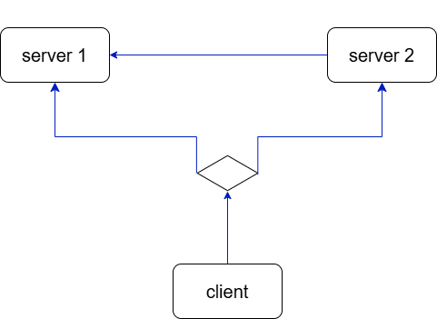

# TCP-Servers-Client-two-servers-
This is Client-Server Socket Program with two servers 

## The target :
We want to program a simpel TCP Servers/Client application with C language , and in our case we will working for two servers .

## The problem :
we need to program a multiple servers TCP protocol , and this servers will be capable of communicating with each other , and the clients shoud be able to choose any server to connect with to .
the problem is how can we enable the servers to communicate with other ?
and how can we anable the client to connect with a choosen server ?

## solution method :
the solutino methode that we followed is : 
##### for the servers :
make a server the main server and connect the second server ot it as a client .
##### for the client :
before the connecting we asked the client to choose one of the two servers to connect to it . 

## The execution :
we have three parties : 

##### server 1 ( [`sever.c`](server.c) ) : this is the main server in our case and it must be the firt running server because the other server well try to connect with it .

##### server 2 ( [`sever2.c`](server2.c) ) .

##### client ( [`client.c`](client.c) ) .

### how it running :

### the staps of the execution :

#### 1. running the first server .
#### 2. running the second server .
#### 3. the second server will connect with the first one .
#### 4. the client choose a server to connect to .
#### 5. the client will sand a massege to the choosen server .
#### 6. the choosen server will do the process the massege .
#### 7. the server will sand the result to the other one .

